## <picture></picture> **About Me**

- Passionate about **Cybersecurity, AI, and Secure Web Development**  
- Currently experimenting with **Azure AI Foundry, n8n and pgvector databases**
- Working towards the **Azure AI Engineer Associate (AI-102)** and **Security+** Certification.
- Open to **collaborations, internships, and job opportunities**  
- Contact me at **justin.wj2003@gmail.com**  
  

##  **Skills**

### **Programming Languages:**

### **Frameworks & Tools:**

## 📊 **GitHub Stats**

  

    
  

  <table>
    <tr>
      <td>
        
      </td>
      <td>
        
      </td>
    </tr>
  </table>

 

## 🤝 **Let's Connect!**

---

_Last Edited on: August 15, 2025_
